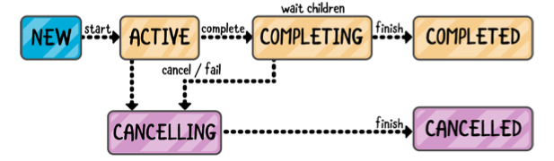

## Chapter 3: Getting Started with coroutines


### 개요

* 루틴과 프로그램 실행 흐름에 대해서 알아보자
* 코드에서 서스펜드 펑션과 서스펜드 포인트를 알아보자
* 코루틴을 Launch 해보고 Job을 만들어보자
* UI 스레드에 게시하는 것을 포함한 일반적인 Task로 연습해보자


### Executing routines

모든 프로그램은 Main Routine에서 실행되며 여기서 다른 함수를 호출하면 Sub Routine이 실행된다. 이러한 Routine은 Call Stack에 의해 관리되고 현재 꺼내진 Routine이 끝나면 호출 Routine으로 돌아간다. (Stack 구조를 생각하면 됨) 최종적으로 Call Stack이 비어지면 프로그램은 종료된다.

subroutine은 Blocking call 이다. 하지만 coroutine은 병렬 실행을 하기 때문에 Non Blocking call 이다. 이는 실행한 coroutine들을 잊고 나머지 코드를 실행한다는 것을 의미한다.


### Launching a coroutine

10만개의 coroutine 실행

```kotlin
fun main() { 
  (1..10000).forEach {
		GlobalScope.launch { this : CoroutineScope
			val threadName = Thread.currentThread().name
      println("$it printed on thread ${threadName}")
      this.launch()
    }
	}
	Thread.sleep(1000) 
}
```

일반적으로 10만개의 thread를 동작한다면 OutOfMemory가 발생하겠지만, 코루틴은 가볍기 때문에 성능에 영향없이 실행 가능하다.

이 코드에서 몇가지 알고가야하는 중여한 부분이 있는데, 첫번째로는 `launch()`에 전달된 code block을 coroutine body라고 부르며, `launch()` 는 coroutine builder라고 부른다는 것과 두번째로는 코루틴을 실행할 때 CorutineScope를 제공해야한다는 것이다. 이는 코루틴이 시작점의 lifecycle 과 아무 연관이 없기 때문이다. 코루틴에 `GlobaScope` 와 같은 스코프를 지정해서 Application이 종료되면 종료 될 수 있도록 명시해야한다. 위 코드에서 `Thread.sleep(1000)`는 어플리케이션이 종료되지 않도록 잡아두기 위함이다.


### Building coroutines

코루틴은 coroutine builder를 통해 만든다. 이전 코드에서도 `launch()` 라는  coroutine builder를 사용 했다. 아래는 `launch()` 의  시그니처이다.

```kotlin
public fun CoroutineScope.launch(
	context: CoroutineContext = EmptyCoroutineContext,
  start: CoroutineStart =	CoroutineStart.DEFAULT,
  block: suspend CoroutineScope.() -> Unit
): Job
```

context, start는 옵셔널이며, `CoroutineContext` 는 현재 코루틴에 대한 컨텍스트 정보를 유지하는 데이터 셋이다. 이것은 `Job`과 `Dispacher` 를 포함한다. 이 둘에 대해서는 나중에 설명할 것이고 현재는 아무 값도 설정하지 않고 썼기 때문에 `EmptyCoroutineContext` 로 사용되었다. 이는 `CoroutineScope` 가 사용하는 Context와 같다.


```kotlin
public fun CoroutineScope.launch(
  ...
) {
	val newContext = newCoroutineContext(context)  
  ...
}

-> 

CoroutineScope.newCoroutineContext(context: CoroutineContext): CoroutineContext {
  val combined = coroutineContext + context
  ...
}
```


그  다음 `CoroutineStart` 코루틴의 시작 방법에 대해서 설정할 수 있는 파라미터이다. 해당 파라미터의 옵션은 아래와 같다.

- **DEFAULT**: 코루틴 컨텍스트에 따라 즉시 스케쥴 된다.
- **LAZY**: 코루틴을 layz하게 시작한다.
- **ATOMIC**: 이 코루틴이 시작전에 취소 되지 않는다는 점만 제외하고 default와 동일하다.
- **UNDISPATCHED**: 처음 만나는 서스펜션 포인트까지 실행한다.


마지막은 코루틴 블럭이다. 파라미터 시그니처가  `suspend CoroutineScope.() -> Unit` 으로 reciver CoroutineScope이 있기에 중첩 구조가 가능하다.


### Scoping coroutines

매인 프로그램의 종료 혹은 정지가 코루틴에게 동일하게 적용되지 않는다. 한마디로 응용프로그램이 종료되어도 코루틴이 실행되는 이상한 버그로 이어질 수 있다는 것을 의미한다. 이러한 문제를 해결하기 위해 `CoroutineScope` 사용해야 한다. GlobalScope나 CoroutineScpoe Interface를 구현하여 사용 할 수 있다.


### Explaining jobs

코루틴을 실행할때 만든 람다 블럭은 바로 실행되는 것이 아니라 작업 큐에 들어가게 된다. 이때 들어간 코루틴을 핸들링 할때 사용하는 것이 `Job`이다. 예를들어 Job과 Join을 이용하여 다른 Job과의 종속성을 설정할 수 있고 다른 Job들과 계층 구조를 만들어서 child job이 끝나기 전까지 parent job은 complete 되지 않도록 설정할 수 있다.



위의 다이어 그램은 Job 의 상태를 표현한 것이다.

Job이 생성되면 **NEW** 상태로 시작되며 이는 곧바로 **ACTIVE** 상태로 전이된다.(builder에 lazy start 옵션을 넣은 경우 제외) 실행중인 코루틴은 모두 ACTIVE 상태이며 취소되면 **CANCLELLING** 완료되면 **COMPLETING**으로 전이된다.

여기서 유의해야 하는 것은 종속성에 따른 상태전의 방식이다. 만약 자식 Job이 있는 경우 COMPLETING 상태에서 모든 자식 Job이 끝날때 까지 대기한다. **그리고 COMPLETING 상태는 내부적인 것이고 외부에서 상태를 체크하면 ACTIVE로 반환한다.**


### Canceling Jobs

백그라운드 작업에서 많은 일들이 일어날 수 있고 그중에는 에러 혹은 상황에 따라 작업 취소를 해야 하는 상황이 있을 수 있다.

작업 취소는 `cancle()`을 통해 할 수 있고 이는 해당 작업의 부모, 자식의 작업도 모두 취소한다. 하지만 작업을 취소하더라도 곧바로 작업이 취소되지는 않는다. 만약 작업 취소 요청을 하고나서 동작되면 안되는 코드라면 `isActive`를 이용하여 상태를 체크해야한다.


### Dependent Jobs in action

Job 종속성 만드는 법

```kotlin
fun main() {
  val job1 = GlobalScope.launch(start = CoroutineStart.LAZY) {	// 코루틴 시작 
    delay(200)
    println("Pong")
    delay(200)
  }
  GlobalScope.launch { 
    delay(200)
    println("Ping")
    job1.join() // 위의 코루틴의 Job 객체를 이용해서 위의 코루틴 Complete 상태까지 대기
    println("Ping")
    delay(200)
  }
  Thread.sleep(1000) 
}
```

추가적으로 Lazy Option으로 시작된 job1은 필요할때까지 시작되지 않는다. 그렇기 때문에 해당 snippet의 결과는

ping -> pong -> ping 으로 나온다.


### Managing Job hierarchy

```kotlin
fun main() {
    with(GlobalScope) {
        val parentJob = launch { // 코루틴 생성 - 이 코루틴을 핸들링하는 job 객체 parentJob에 저장
            delay(200)
            println("I’m the parent")
            delay(200)
        }
        // parentJob을 참조하도록 하여 계층 만듦
        // Job 추상 클래스는 CoroutineContext 구현했기 때문에
        // context = parentJob 가능
        launch(context = parentJob) { // 여기선 CoroutineContext 전달 했으므로 Scope의 context와 병합
            delay(200)								
            println("I’m a child")		
            delay(200)
        }
        if (parentJob.children.iterator().hasNext()) {
            println("The Job has children ${parentJob.children}")
        } else {
            println("The Job has NO children")
        }
        Thread.sleep(1000)
    }
}
```

위의 코드에서 `context = parentJob` 를 지워주면 자식 Job 이 없다는 문구를 출력한다.


### Using standard functions with coroutines

```kotlin
fun main() {
    var isDoorOpen = false
    println("Unlocking the door... please wait.\n")
    GlobalScope.launch {
        delay(3000)
        isDoorOpen = true
    }
    GlobalScope.launch {
        repeat(4) {
            println("Trying to open the door...\n")
            delay(800)
            if (isDoorOpen) {
                println("Opened the door!\n")
            } else {
                println("The door is still locked\n")
            }
        }
    }
    Thread.sleep(5000)
}
```

Standard 함수인 repeat을 이용해서 retry 로직 만들기. 이런 방식으로 네트워크 호출에서도 사용할 수 있을 것


### Posting to the UI thread

```kotlin
GlobalScope.launch(Dispatchers.Main) {	// 이런 식으로 Main thread에서 동작하게 할 수 있음
  val uiThreadName = Thread.currentThread().name
  println("I’m Job 2 in thread $uiThreadName")
}
```


Dispatchers.Main은 코루틴 동작하는 환경에 따라 다르기에 안드로이드의 Main을 사용하기 위해선 아래의 종속성을 추가해야함

```groovy
implementation ’org.jetbrains.kotlinx:kotlinx-coroutines- android:...’
```


### Key Points

* Coroutine Builder를 통해 코루틴을 build 할 수 있다.
* 기본 Coroutine Builder는 `launch()` 이다.
* 코루틴을 실행할때 `Job` 객체를 반환한다.
* `Job`을 이용하여 작업을 취소할 수 있고 다른 작업과 합칠 수 있다. (join)
* 여러 `Job` 을 묶어서 취소 할 수 있다. (job hierarchy)
* `Job`의 상태를 체크하여 코루틴을 협력적으로 동작 시킬 수 있다.
* 코루틴를 실행하기 위해선 scope가 필요하다.
* 코루틴은 `delay()` 를 통해 딜레이 시킬 수 있다.

