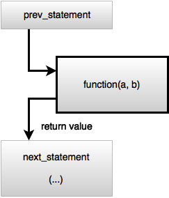
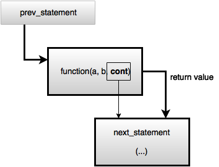
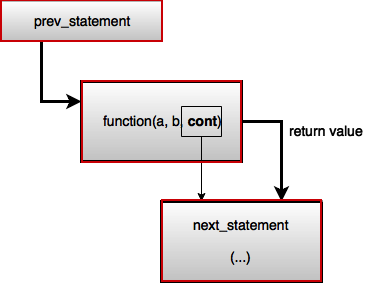
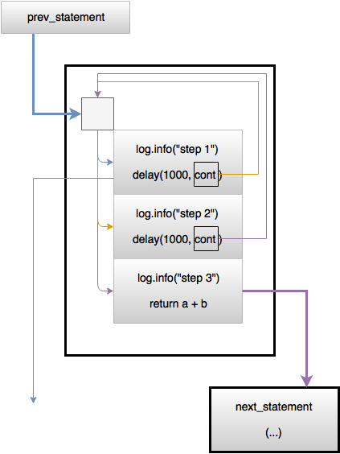

## Chapter 4: Coroutine Continuation Passing Style

### CPS(Continuation Passing Style)란?

코루틴의 suspend function을 설명하면서 Continuation 이라는 개념이 나오는데, 이를 제대로 이해하기 위해서 CPS를 알아야 한다.

**CPS(Continuation Passing Style)**를 간단하게 설명하면 제어 흐름을 Continuation 형태로 전달하는 프로그래밍 스타일을 말한다.여기서 Continuation은 우리가 사용하던 return을 대체하는 개념이다(direct style).

Direct Style과 CPS를 비교하여 CPS를 이해해보자.

Direct Style은 흔히 우리가 사용하는 return과 같다. function을 호출하면 function을 진행하고 끝나면 호출한 call site로 되돌아 와 next_statement를 이어서 동작한다.

위와 다르게 CPS는 호출에 function에 next_statement를 진행하는 Callback인 Continuation 인자로 넘겨준다. 그리고 function을 진행하고 끝나면 넘겨준 Continuation을 invoke(resume) 해준다. 이 Continuation이 next_statement를 이어서 동작하게 해주는 return과 비슷한 역할일 해주는 것이다.

우리는 항상 return을 사용한 코드를 다뤄 왔기 때문에 익숙하지 않지만, 위의 정리를 보면 return이라는 개념이 없어도 Continuation을 통해 프로그래밍이 가능하다는 사실을 알 수 있다. 그리고 이를 이용한 프로그래밍을 CPS라 부르는 것이다.

### CPS(Continuation Passing Style) 장점

위에서 return 개념을 Continuation으로 대체하여 Coroutine에서 얻으려는게 무엇일까? 아마도 제일 큰 장점은 CPS는 우리가 사용하던 return 방식에 비해 task를 나누기 쉽다는 점이며 이를 이용해 스케쥴링을 효율적으로 할 수 있다는 점이다.

### State Machine

참고

https://labs.pedrofelix.org/guides/kotlin/coroutines/coroutines-and-state-machines

https://www.lukaslechner.com/understanding-kotlin-coroutines-with-this-mental-model/

