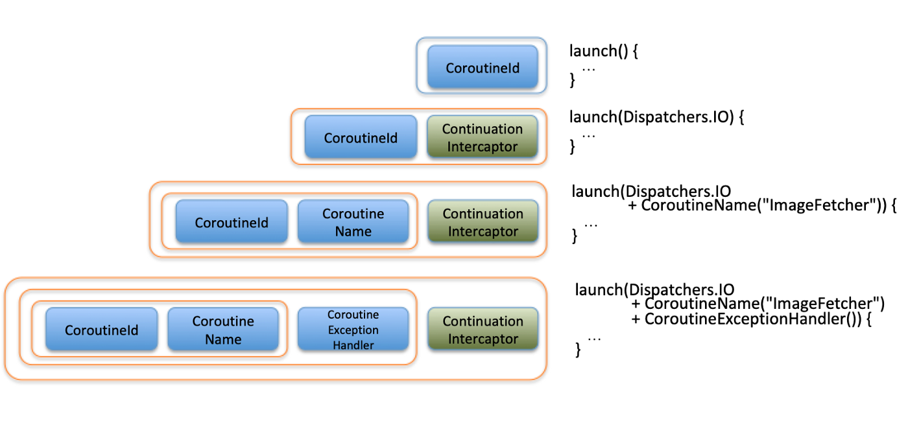

## Chapter 6: Coroutine Context


### Contextualizing coroutines

각 코루틴들은 CorotuineContext를 갖는다. 이 컨텍스트는 **CorotuineContext.Elements** 의 Set이며 이는 예외 처리 방식, 실행 흐름 방식, 라이프 사이클과 같은 코루틴 동작 방식을 설명한다.

**CorotuineContext.Elements** 의 주요 요소는 아래와 같은 것들이 있다.

* Job : 생명 주기가 정의되어 있고 취소 가능한 작업 단위
* ContinuationInterceptor : 코루틴 내에서 Continuation 콜백을 듣고 재개를 가로채는 메커니즘
* CoroutineExceptionHandler : 코루틴 내에세 예외를 처리하는 방식

(CoroutineName이란 Element도 존재)

이러한 context 요소들은 `launch()` 할때 넘겨 줄 수 있다. Job 을 넘기면 해당 코루틴의 Parent Job 으로 설정되어 라이프사이클을 설정가능하며,  CoroutineExceptionHandler을 넘겨 준다면 해당 코루틴에서 발생하는 에러에 대해 어떻게 다룰지 정의 가능하다. 마지막으로 ContinuationInterceptor를 넘겨주어 Continuation이 재개 될때 어떠한 스레드에서 동작하게 할지 정의 할 수 있다. 하지만 매번 ContinuationInterceptor를 구현해주기에는 어려움이 있기 때문에 이미 구현되어 있는 Dispatchers를 사용해도 된다.


```kotlin
public abstract class CoroutineDispatcher : AbstractCoroutineContextElement(ContinuationInterceptor), ContinuationInterceptor {
    	...
}
```


### Using CoroutineContext

코루틴 콘텍스트는 `launch()`에 값을 넘겨줌으로써 사용가능하다. 이전에도 계속 써왔다. 이는 `launch()`에 기본적으로 정의되어 있는 `EmptyCoroutineContext` 를 사용한 것이며 이는 모든 동작들이 default로 정의되어 있는 콘텍스트이다.


### Combining different contexts

CoroutineContext은 `+` 오퍼레이트를 통해 다른 CoroutineContext.Elements와 합성이 가능하다. 이는 아래와 같은 명료한 방법으로 코루틴의 컨텍스트를 만들 수 있게 해준다.

```kotlin
fun main() {
  val defaultDispatcher = Dispatchers.Default // ContinuationInterceptor
  
  val coroutineErrorHandler = CoroutineExceptionHandler { context, error -> 
   	println("Problems with Coroutine: ${error}") // we just print the error here
  }	// CoroutineExceptionHandler
  
  val emptyParentJob = Job()	// Job
  
  val combinedContext = defaultDispatcher + coroutineErrorHandler + emptyParentJob
  
  GlobalScope.launch(context = combinedContext) {
    println(Thread.currentThread().name) 
  }
  
  Thread.sleep(50) 
}
```

이런 방식의 이점은 각 요소를 정의해두고 재사용이 가능하다는 점이다. 예를 들어 복잡한 error handling 코드를 작성했다면 이를 사용할 코루튼 컨텍스트에 더해주기만 하면 된다.

기본적으로 plus 연산자는 오른쪽 피연산자의 element로 대치되는 새로운 Context를 만들어서 리턴한다. 추가로 여기서 intercepter는 빨리 얻을 수 있도록 Context set에서 제일 마지막에 위치하도록 한다.

```kotlin
public operator fun plus(context: CoroutineContext): CoroutineContext =
    if (context === EmptyCoroutineContext) this else // EmptyCoroutineContext는 기본
				// fold인 이유 context가 이미 CombineCoroutine일 수 있기 때문
        context.fold(this) { context, element ->
            // minusKey는 해당 key를 포함하는 context를 리턴
            val removed = acc.minusKey(element.key)	// element의 키는 element 요소의 타입 ex) job
            if (removed === EmptyCoroutineContext) 
                element	// ret
            else {
                val interceptor = 
              		removed[ContinuationInterceptor] // ContinuationInterceptor key로 element get
              
                if (interceptor == null) 
              		CombinedContext(removed, element) // removed = 기존 것, element 새 것
              																			// LinkedList 처럼 reference로 엮여 있음
              																			// CombinedContext의 get은 오른쪽부터 return
              																			// ret
              	else {
                    val left = removed.minusKey(ContinuationInterceptor)
                  
                  	// 기존 element에 interceptor가 empty일때 
                    if (left === EmptyCoroutineContext)
                  		CombinedContext(element, interceptor) // ret
                  
                  	// 기존 element에 interceptor가 empty가 아닐때
                  	else
                  		CombinedContext(CombinedContext(left, element), interceptor) // ret
                }
            }
        }
```




주황색 테두리가 하나의 CombineCoroutine


### Providing contexts & Building the ContextProvider

보통 software에서는 추상화하여 층을 나누는 방식을 선호한다. 위의 snnipet처럼 Context를 정의하는 부분과 사용하는 부분을 같은 Layer에 두기보단 정의한 Context를 Provider로 제공해주는 방식을 사용해보자.

```kotlin
interface CoroutineContextProvider {
  fun context(): CoroutineContext
}

class CoroutineContextProviderImpl(
    private val context: CoroutineContext
) : CoroutineContextProvider {
  override fun context(): CoroutineContext = context
}

GlobalScope.launch(context = provider.context()) { 
  ...
}

val backgroundContextProvider = CoroutineContextProviderImpl(Dispatchers.Default)
```

위와 같이 사용한다면 test 코드를 작성할때에도 context를 mocking 해주기 편해진다.