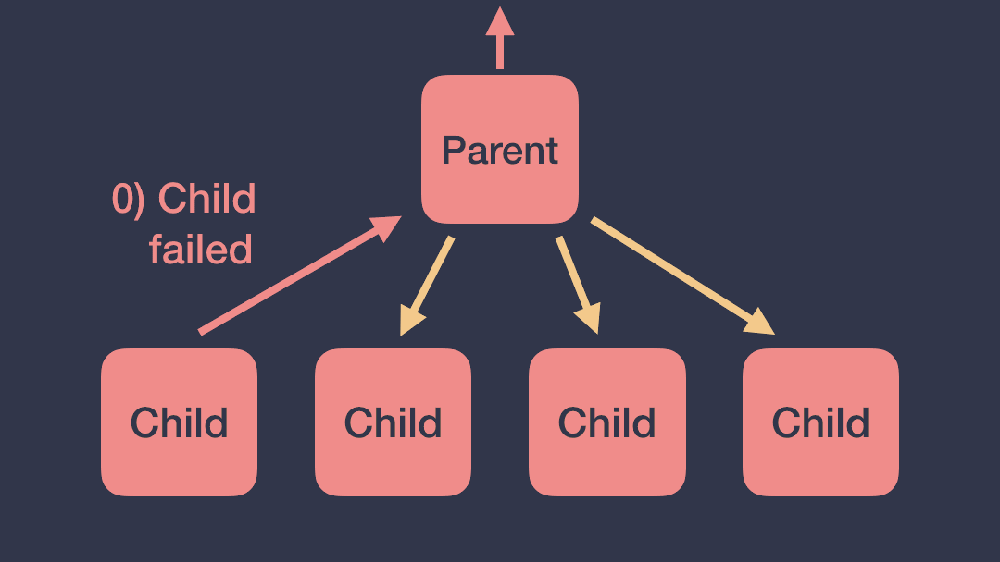
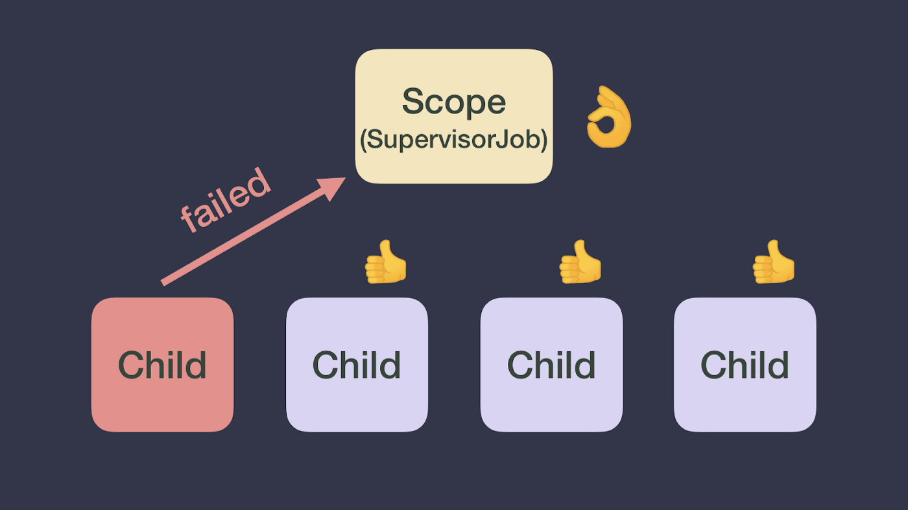

## Exceptions in Coroutines

코루틴은 계층구조로 이루어질 수 있고 예외가 발생했을때 어떻게 이 예외가 전파되는지 알아야 안전한 코드를 작성할 수 있다.

### 계층구조의 코루틴에서의 error, exception

자식 코루틴에서 발생한 에러는 부모에게 전달되고 나머지 자식들에겐 cancellation예외를 전달한다. 그렇기 때문에 계층구조에 있는 하나의 자식 코루틴에서 에러가 발생하면 나머지 코루틴들은 모두 종료된다.

### SupervisorJob으로 자식 코루틴을 에러에서 독립되게 만들기

원래의 Job을 이용한 계층구조를 만들면 일반적인 상황에서 다루기 불편하다. 이러한 문제점을 해결 할 수 있는 방법이 부모 Job을 SupervisorJob으로 만드는 것이다. SupervisorJob은 자식 Job이 실패하더라도 다른 자식 Job에 cancellation예외를 전달하지 않는다.

### 일괄적인 에러처리를 위한 CoroutineExceptionHandler

각각의 코루틴에 try/catch를 이용해 예외를 처리하면 코드가 복잡해진다. 이를 해결하기 위해 코루틴에서는 CoroutineExceptionHandler을 제공해준다. 핸들러가 설정되어 있는 Scope에서 발생한 예외는 모두 Handler로 전달된다.

### 코루틴 예외처리 방식 정리

코루틴 예외처리 방식은 상황에 따라 많이 달라진다. 이를 확실히 정리해두어야 안전하게 사용 가능할 것이다.

1. 자식 코루틴의 handler는 적용안된다. 항상 최상단 부모의 handler를 사용한다.
2. launch 블럭안의 예외는 바로 발생하지만 async 블럭안의 예외는 await 시점에 발생한다. (handler를 달아도 마찬가지)
3. async가 root가 아닐땐 바로 launch의 룰을 따른다. (바로 예외)

